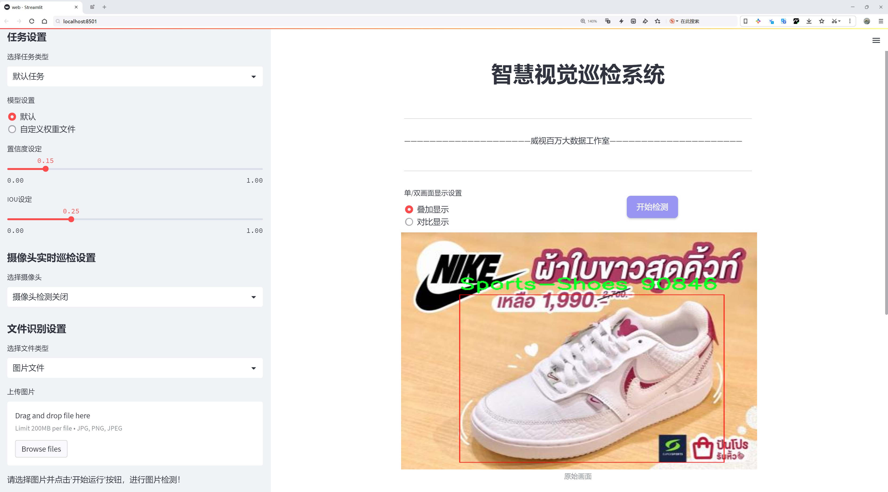
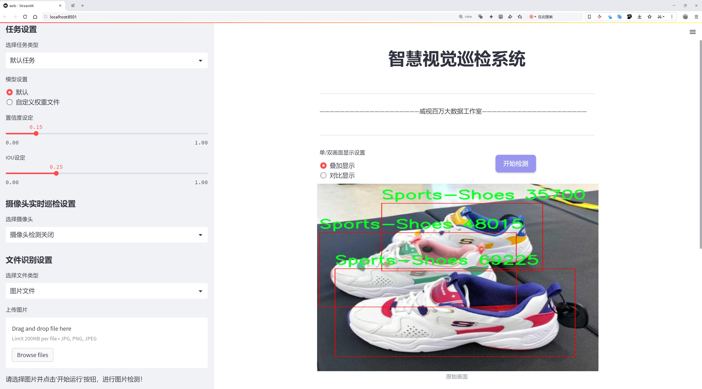
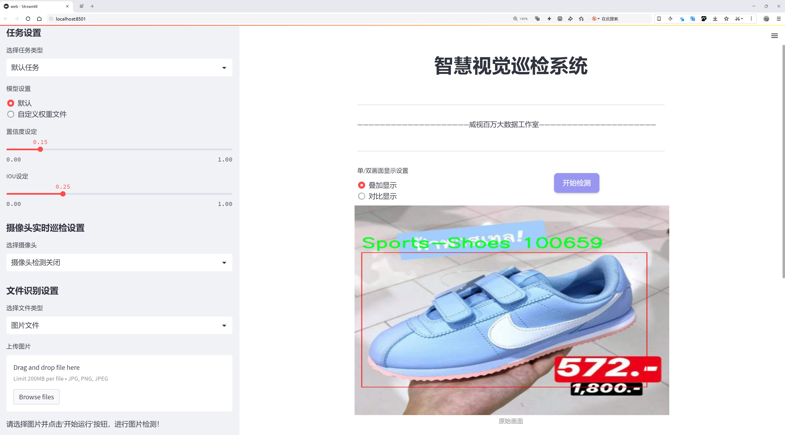
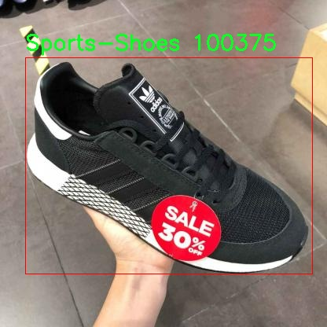
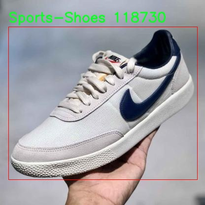
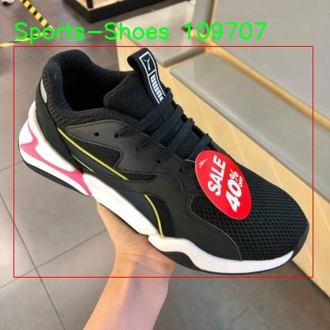
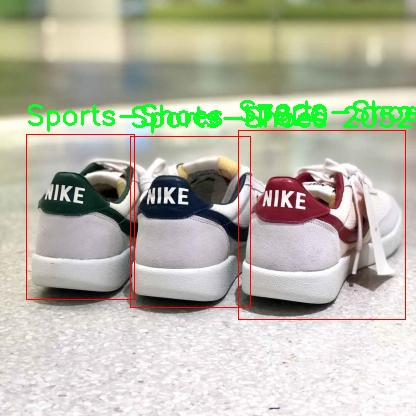
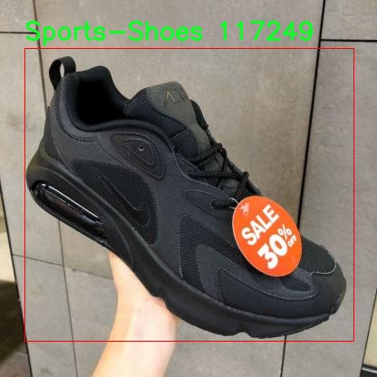

# 运动鞋检测检测系统源码分享
 # [一条龙教学YOLOV8标注好的数据集一键训练_70+全套改进创新点发刊_Web前端展示]

### 1.研究背景与意义

项目参考[AAAI Association for the Advancement of Artificial Intelligence](https://gitee.com/qunmasj/projects)

项目来源[AACV Association for the Advancement of Computer Vision](https://github.com/qunshansj/good)

研究背景与意义

随着运动健身文化的普及和人们对健康生活方式的追求，运动鞋作为运动装备的重要组成部分，其市场需求逐年攀升。运动鞋不仅在功能性上满足了运动爱好者的需求，更在时尚和个性化方面受到广泛关注。因此，如何高效、准确地识别和分类运动鞋，成为了计算机视觉领域一个重要的研究方向。传统的运动鞋检测方法多依赖于人工标注和经验判断，效率低下且容易受到主观因素的影响。随着深度学习技术的快速发展，基于卷积神经网络（CNN）的目标检测算法逐渐成为解决这一问题的有效工具。

YOLO（You Only Look Once）系列算法因其高效性和实时性，已在目标检测领域取得了显著成果。YOLOv8作为该系列的最新版本，进一步提升了检测精度和速度，尤其在复杂场景下的表现尤为突出。然而，现有的YOLOv8模型在特定领域的应用仍存在一定的局限性，尤其是在运动鞋这一细分市场。为此，基于改进YOLOv8的运动鞋检测系统的研究具有重要的理论和实际意义。

首先，从理论层面来看，运动鞋的多样性和复杂性为目标检测算法提出了新的挑战。不同品牌、款式、颜色和材质的运动鞋在外观上差异显著，如何提高模型对这些变化的适应能力，是当前研究的热点之一。通过对YOLOv8进行改进，可以在模型结构、损失函数、数据增强等方面进行探索，进而提升模型的泛化能力和鲁棒性。此外，运动鞋检测的研究还可以为其他物品的检测提供借鉴，推动目标检测技术在更多领域的应用。

其次，从实际应用角度来看，运动鞋检测系统的开发将为电商平台、智能零售、库存管理等提供有力支持。通过自动化的运动鞋检测，商家可以实时监控库存状态，优化供应链管理，提高运营效率。同时，消费者在选购运动鞋时，可以通过图像识别技术快速找到符合自己需求的产品，提升购物体验。此外，该系统还可以为运动鞋的真伪鉴别提供技术支持，降低假冒伪劣产品对市场的冲击。

最后，数据集的构建对于运动鞋检测系统的成功实施至关重要。本研究所使用的数据集包含2154张运动鞋图像，涵盖了两个主要类别，能够为模型的训练和验证提供丰富的样本支持。通过对数据集的深入分析与处理，可以挖掘出更多的特征信息，进而提高模型的检测精度和效率。

综上所述，基于改进YOLOv8的运动鞋检测系统的研究，不仅在理论上丰富了目标检测领域的研究内容，也在实际应用中具有广泛的前景和价值。随着技术的不断进步，该系统有望在未来的智能零售和电商领域发挥重要作用，为消费者和商家带来双赢的局面。

### 2.图片演示







##### 注意：由于此博客编辑较早，上面“2.图片演示”和“3.视频演示”展示的系统图片或者视频可能为老版本，新版本在老版本的基础上升级如下：（实际效果以升级的新版本为准）

  （1）适配了YOLOV8的“目标检测”模型和“实例分割”模型，通过加载相应的权重（.pt）文件即可自适应加载模型。

  （2）支持“图片识别”、“视频识别”、“摄像头实时识别”三种识别模式。

  （3）支持“图片识别”、“视频识别”、“摄像头实时识别”三种识别结果保存导出，解决手动导出（容易卡顿出现爆内存）存在的问题，识别完自动保存结果并导出到tempDir中。

  （4）支持Web前端系统中的标题、背景图等自定义修改，后面提供修改教程。

  另外本项目提供训练的数据集和训练教程,暂不提供权重文件（best.pt）,需要您按照教程进行训练后实现图片演示和Web前端界面演示的效果。

### 3.视频演示

[3.1 视频演示](https://www.bilibili.com/video/BV1RYHpeNEby/?vd_source=ff015de2d29cbe2a9cdbfa7064407a08)

### 4.数据集信息展示

##### 4.1 本项目数据集详细数据（类别数＆类别名）

nc: 2
names: ['-', 'Sports-Shoes']


##### 4.2 本项目数据集信息介绍

数据集信息展示

在本研究中，我们使用了名为“Sports Shoes”的数据集，以改进YOLOv8的运动鞋检测系统。该数据集专注于运动鞋的识别与分类，旨在为计算机视觉领域提供一个高效且精准的训练基础。数据集的类别数量为2，具体类别列表包括“Sports-Shoes”，而另一个类别则被标记为“-”，这意味着在该数据集中并未包含其他类别的运动鞋或相关物品。这样的设计使得数据集的聚焦更加明确，便于模型在特定任务上的训练与优化。

“Sports Shoes”数据集的构建考虑到了多样性与代表性，涵盖了不同品牌、款式和颜色的运动鞋。这种多样性不仅有助于提高模型的泛化能力，还能增强其在实际应用中的实用性。数据集中包含的运动鞋图像经过精心挑选，确保每一张图像都具备良好的清晰度和标注准确性，从而为YOLOv8的训练提供了高质量的输入数据。

在数据标注方面，数据集采用了精确的标注技术，确保每一双运动鞋都被准确地框定在图像中。这种精细的标注方法为模型提供了清晰的学习目标，使得YOLOv8能够更好地理解运动鞋的特征和形态。通过这种方式，模型能够在训练过程中学习到运动鞋的关键特征，如鞋面的材质、鞋底的形状以及整体的设计风格等，从而提升其检测的准确性和鲁棒性。

此外，数据集的设计还考虑到了不同场景下运动鞋的表现。例如，数据集中包含了在不同光照条件、背景环境和拍摄角度下的运动鞋图像。这种多样化的场景设置不仅丰富了数据集的内容，也为模型在实际应用中面对复杂环境时的表现提供了保障。通过训练，YOLOv8能够在各种条件下识别运动鞋，增强了其在现实世界应用中的适应能力。

在数据集的使用过程中，我们还注重了数据的平衡性。虽然类别数量较少，但通过合理的样本分配和多样化的图像选择，确保了每个类别的样本量足够，避免了模型在训练过程中出现偏向某一类别的现象。这种平衡性对于提高模型的整体性能至关重要，尤其是在运动鞋检测这样一个细分领域中，准确性和可靠性是评估模型性能的重要指标。

总之，“Sports Shoes”数据集为改进YOLOv8的运动鞋检测系统提供了坚实的基础。通过精确的标注、多样化的样本和合理的场景设置，该数据集不仅提升了模型的训练效果，也为后续的研究和应用奠定了良好的基础。未来，我们期待通过不断优化数据集和模型，进一步提升运动鞋检测的准确性和效率，为相关领域的应用提供更为强大的技术支持。











### 5.全套项目环境部署视频教程（零基础手把手教学）

[5.1 环境部署教程链接（零基础手把手教学）](https://www.ixigua.com/7404473917358506534?logTag=c807d0cbc21c0ef59de5)


[5.2 安装Python虚拟环境创建和依赖库安装视频教程链接（零基础手把手教学）](https://www.ixigua.com/7404474678003106304?logTag=1f1041108cd1f708b01a)

### 6.手把手YOLOV8训练视频教程（零基础小白有手就能学会）

[6.1 环境部署教程链接（零基础手把手教学）](https://www.ixigua.com/7404477157818401292?logTag=d31a2dfd1983c9668658)

### 7.70+种全套YOLOV8创新点代码加载调参视频教程（一键加载写好的改进模型的配置文件）

[7.1 环境部署教程链接（零基础手把手教学）](https://www.ixigua.com/7404478314661806627?logTag=29066f8288e3f4eea3a4)

### 8.70+种全套YOLOV8创新点原理讲解（非科班也可以轻松写刊发刊，V10版本正在科研待更新）

由于篇幅限制，每个创新点的具体原理讲解就不一一展开，具体见下列网址中的创新点对应子项目的技术原理博客网址【Blog】：


[8.1 70+种全套YOLOV8创新点原理讲解链接](https://gitee.com/qunmasj/good)

### 9.系统功能展示（检测对象为举例，实际内容以本项目数据集为准）

图9.1.系统支持检测结果表格显示

  图9.2.系统支持置信度和IOU阈值手动调节

  图9.3.系统支持自定义加载权重文件best.pt(需要你通过步骤5中训练获得)

  图9.4.系统支持摄像头实时识别

  图9.5.系统支持图片识别

  图9.6.系统支持视频识别

  图9.7.系统支持识别结果文件自动保存

  图9.8.系统支持Excel导出检测结果数据


### 10.原始YOLOV8算法原理

原始YOLOv8算法原理

YOLOv8是由Ultralytics公司于2023年发布的最新一代目标检测算法，作为YOLO系列的延续，它结合了之前多种先进技术，形成了一种高效且准确的目标检测解决方案。YOLOv8的设计理念在于实现高效的实时目标检测，同时保持较高的检测精度，这使得它在各类应用场景中表现出色，尤其是在需要快速响应的环境中，如自动驾驶、监控系统以及工业自动化等。

YOLOv8n作为该系列中的一个重要版本，采用了多项创新设计。首先，在主干网络方面，YOLOv8n引入了C2f模块来替代YOLOv5中的C3模块。C2f模块的设计灵感来源于YOLOv7的ELAN结构，它通过将特征提取过程分为两个分支，增强了特征的重用性和梯度流动性。具体而言，C2f模块由多个CBS（卷积+归一化+SiLU激活）模块和若干个Bottleneck组成，这种结构能够有效缓解深层网络中的梯度消失问题，提升模型的学习能力和收敛速度。

在特征融合方面，YOLOv8n采用了PAN-FPN（Path Aggregation Network - Feature Pyramid Network）结构。这一结构通过自下而上的特征融合方式，结合了不同层次的特征信息，确保了模型在处理多尺度目标时的准确性。通过这种设计，YOLOv8能够在不同的特征层之间进行信息的有效传递，从而提高了对小目标和复杂场景的检测能力。

YOLOv8n的另一个显著特点是其Anchor-Free的检测方式。传统的YOLO系列模型依赖于预定义的锚框进行目标检测，而YOLOv8n则抛弃了这一方法，采用了更为灵活的Anchor-Free策略。这一策略使得模型能够在没有锚框的情况下，直接从特征图中预测目标的位置和类别，简化了模型的设计并提高了检测的灵活性。

在损失函数的设计上，YOLOv8n使用了VFLLoss作为分类损失，并结合DFLLoss和CIoULoss进行边框回归。这种损失函数的组合旨在提高模型在面对复杂背景和小目标时的检测精度，尤其是在样本不平衡的情况下，能够有效提升模型的学习效果。

数据预处理方面，YOLOv8n继承了YOLOv5的策略，采用了多种数据增强技术，如马赛克增强、混合增强、空间扰动和颜色扰动等。这些增强手段不仅丰富了训练数据集，还提高了模型的泛化能力，使其在实际应用中能够更好地适应不同的环境和条件。

YOLOv8n的网络结构可以分为输入层、主干网络、特征融合层和解耦头。输入层负责将图像数据转换为适合模型处理的格式，主干网络则通过C2f模块提取特征，特征融合层利用PAN-FPN结构将不同层次的特征进行有效整合，最后，解耦头负责将融合后的特征转换为最终的检测结果。

在解耦头的设计中，YOLOv8n借鉴了YOLOX和YOLOv6的思路，采用了二阶段的FCOS目标检测网络结构。该结构通过将分类和回归任务分开处理，进一步提高了模型的检测精度和效率。解耦头的输出包括多个尺度的特征图，分别对应于不同大小的目标，这种设计使得YOLOv8n在处理多尺度目标时表现得更加灵活和高效。

总的来说，YOLOv8n通过引入C2f模块、PAN-FPN结构以及Anchor-Free检测方式，结合先进的损失函数和数据增强策略，形成了一种高效、准确的目标检测算法。这些创新设计不仅提升了模型的性能，也为目标检测领域带来了新的思路和方向。随着YOLOv8的广泛应用，预计将会在各类实际场景中展现出其强大的能力，为自动化和智能化的发展提供有力支持。


### 11.项目核心源码讲解（再也不用担心看不懂代码逻辑）

#### 11.1 ultralytics\engine\__init__.py

根据您提供的代码片段 `# Ultralytics YOLO 🚀, AGPL-3.0 license`，这实际上是一个注释，说明了代码的来源和许可证信息。由于没有具体的代码内容，无法进行逐文件分析和提取核心部分。

不过，我可以给您一个关于Ultralytics YOLO（You Only Look Once）模型的基本介绍和一些核心概念的注释示例。YOLO是一种实时目标检测系统，能够在图像中快速识别和定位多个对象。

以下是一个假设的YOLO模型核心代码的示例，以及详细的中文注释：

```python
import torch  # 导入PyTorch库，用于深度学习模型的构建和训练
import torchvision.transforms as transforms  # 导入图像处理库，用于数据预处理
from models.yolo import Model  # 从模型模块导入YOLO模型类

# 定义图像预处理的转换操作
transform = transforms.Compose([
    transforms.Resize((640, 640)),  # 将输入图像调整为640x640的大小
    transforms.ToTensor(),  # 将图像转换为张量格式
])

# 加载YOLO模型
model = Model(cfg='yolov5s.yaml', ch=3, nc=80)  # 使用YOLOv5s配置文件，输入通道为3（RGB），类别数为80

# 加载预训练权重
model.load_state_dict(torch.load('yolov5s.pt', map_location='cpu'))  # 从文件加载模型权重

# 设置模型为评估模式
model.eval()  # 将模型设置为评估模式，禁用dropout等训练时特性

# 进行目标检测的函数
def detect(image):
    # 对输入图像进行预处理
    img_tensor = transform(image).unsqueeze(0)  # 添加一个维度以适应模型输入

    # 使用模型进行推理
    with torch.no_grad():  # 禁用梯度计算以节省内存
        predictions = model(img_tensor)  # 获取模型的预测结果

    return predictions  # 返回预测结果
```

### 代码注释说明：
1. **导入库**：引入必要的库和模块，以便后续使用。
2. **图像预处理**：定义图像的预处理步骤，包括调整大小和转换为张量格式。
3. **加载模型**：实例化YOLO模型，并加载预训练的权重文件。
4. **评估模式**：将模型设置为评估模式，以确保在推理时不使用训练特性。
5. **目标检测函数**：定义一个函数用于处理输入图像并返回模型的预测结果。

如果您有更具体的代码或文件需要分析，请提供详细内容，我将乐意帮助您进行分析和注释。

这个文件是Ultralytics YOLO项目的一部分，文件名为`__init__.py`，它的主要作用是将包含该文件的目录标识为一个Python包。文件开头的注释表明该项目是Ultralytics开发的YOLO（You Only Look Once）模型，使用的是AGPL-3.0许可证。这意味着该项目是开源的，用户可以自由使用、修改和分发，但需要遵循相应的许可证条款。

在Python中，`__init__.py`文件通常用于初始化包的命名空间，可以在其中定义包的公共接口，导入子模块或设置包的初始状态。虽然在这个文件中没有具体的代码实现，但它的存在对于确保包的正确导入和使用是非常重要的。

总体来说，这个文件是Ultralytics YOLO项目结构的一部分，确保了该项目能够作为一个完整的Python包被使用和分发。

#### 11.2 ultralytics\models\fastsam\val.py

以下是代码中最核心的部分，并附上详细的中文注释：

```python
# 导入所需的类
from ultralytics.models.yolo.segment import SegmentationValidator
from ultralytics.utils.metrics import SegmentMetrics

class FastSAMValidator(SegmentationValidator):
    """
    自定义验证类，用于在Ultralytics YOLO框架中进行快速SAM（Segment Anything Model）分割。

    该类扩展了SegmentationValidator类，专门定制了快速SAM的验证过程。此类将任务设置为“分割”，并使用SegmentMetrics进行评估。
    此外，为了避免在验证过程中出现错误，禁用了绘图功能。
    """

    def __init__(self, dataloader=None, save_dir=None, pbar=None, args=None, _callbacks=None):
        """
        初始化FastSAMValidator类，将任务设置为“分割”，并将度量标准设置为SegmentMetrics。

        参数：
            dataloader (torch.utils.data.DataLoader): 用于验证的数据加载器。
            save_dir (Path, optional): 保存结果的目录。
            pbar (tqdm.tqdm): 用于显示进度的进度条。
            args (SimpleNamespace): 验证器的配置。
            _callbacks (dict): 用于存储各种回调函数的字典。

        注意：
            此类禁用了ConfusionMatrix和其他相关度量的绘图，以避免错误。
        """
        # 调用父类的初始化方法
        super().__init__(dataloader, save_dir, pbar, args, _callbacks)
        # 设置任务类型为“分割”
        self.args.task = "segment"
        # 禁用绘图功能以避免错误
        self.args.plots = False  
        # 初始化度量标准为SegmentMetrics
        self.metrics = SegmentMetrics(save_dir=self.save_dir, on_plot=self.on_plot)
```

### 代码核心部分说明：
1. **类定义**：`FastSAMValidator`类继承自`SegmentationValidator`，用于实现快速SAM的分割验证。
2. **初始化方法**：`__init__`方法用于初始化验证器，设置任务类型为“分割”，并禁用绘图功能，以避免在验证过程中出现错误。
3. **度量标准**：使用`SegmentMetrics`来评估分割性能，并指定结果保存的目录。

这个程序文件定义了一个名为 `FastSAMValidator` 的类，该类用于在 Ultralytics YOLO 框架中进行快速 SAM（Segment Anything Model）分割的自定义验证。它继承自 `SegmentationValidator` 类，并针对快速 SAM 的验证过程进行了特定的定制。

在类的文档字符串中，说明了该类的主要功能和属性。它将任务设置为“分割”，并使用 `SegmentMetrics` 进行评估。此外，为了避免在验证过程中出现错误，绘图功能被禁用。

构造函数 `__init__` 用于初始化 `FastSAMValidator` 类的实例。它接受多个参数，包括数据加载器、结果保存目录、进度条、配置参数以及回调函数字典。构造函数首先调用父类的初始化方法，然后将任务类型设置为“segment”，并禁用绘图功能，以避免在验证过程中出现与混淆矩阵和其他相关指标绘图相关的错误。最后，它还初始化了 `SegmentMetrics` 实例，用于在指定的保存目录中进行评估。

总体而言，这个类的设计旨在为快速 SAM 提供一个专门的验证框架，确保在分割任务中能够有效地评估模型性能，同时避免不必要的错误。

#### 11.3 ui.py

```python
import sys
import subprocess

def run_script(script_path):
    """
    使用当前 Python 环境运行指定的脚本。

    Args:
        script_path (str): 要运行的脚本路径

    Returns:
        None
    """
    # 获取当前 Python 解释器的路径
    python_path = sys.executable

    # 构建运行命令
    command = f'"{python_path}" -m streamlit run "{script_path}"'

    # 执行命令
    result = subprocess.run(command, shell=True)
    if result.returncode != 0:
        print("脚本运行出错。")


# 实例化并运行应用
if __name__ == "__main__":
    # 指定您的脚本路径
    script_path = "web.py"  # 这里可以直接指定脚本名称

    # 运行脚本
    run_script(script_path)
```

### 代码注释说明：

1. **导入模块**：
   - `import sys`：导入 `sys` 模块以访问与 Python 解释器相关的变量和函数。
   - `import subprocess`：导入 `subprocess` 模块以便能够创建新进程、连接到它们的输入/输出/错误管道，并获取返回码。

2. **定义 `run_script` 函数**：
   - 该函数接受一个参数 `script_path`，表示要运行的 Python 脚本的路径。
   - 使用 `sys.executable` 获取当前 Python 解释器的路径，以确保使用正确的 Python 环境来运行脚本。
   - 构建一个命令字符串 `command`，该命令使用 `streamlit` 模块运行指定的脚本。
   - 使用 `subprocess.run` 执行构建的命令，并将 `shell=True` 作为参数，允许在 shell 中执行命令。
   - 检查命令的返回码，如果不为 0，表示脚本运行出错，打印错误信息。

3. **主程序入口**：
   - `if __name__ == "__main__":`：确保只有在直接运行该脚本时才会执行以下代码，而不是在被导入时执行。
   - 指定要运行的脚本路径 `script_path`，这里直接指定为 `"web.py"`。
   - 调用 `run_script` 函数，传入脚本路径以运行该脚本。

这个程序文件名为 `ui.py`，主要功能是通过当前的 Python 环境运行一个指定的脚本，具体是使用 Streamlit 框架来启动一个 Web 应用。

首先，程序导入了几个必要的模块，包括 `sys`、`os` 和 `subprocess`。其中，`sys` 模块用于访问与 Python 解释器相关的变量和函数，`os` 模块提供了与操作系统交互的功能，而 `subprocess` 模块则用于执行外部命令。

接下来，程序从 `QtFusion.path` 模块中导入了 `abs_path` 函数，这个函数的作用是获取文件的绝对路径。

程序中定义了一个名为 `run_script` 的函数，该函数接受一个参数 `script_path`，表示要运行的脚本的路径。在函数内部，首先获取当前 Python 解释器的路径，存储在 `python_path` 变量中。然后，构建一个命令字符串，使用 `streamlit run` 命令来运行指定的脚本。这个命令的格式是将 Python 解释器的路径和脚本路径组合在一起。

接着，使用 `subprocess.run` 方法执行构建好的命令。这个方法会在一个新的 shell 中运行命令，并等待其完成。如果命令执行后返回的状态码不为 0，表示脚本运行出错，程序会打印出相应的错误信息。

在文件的最后部分，程序通过 `if __name__ == "__main__":` 语句来判断是否是直接运行该脚本。如果是，则指定要运行的脚本路径，这里使用 `abs_path("web.py")` 来获取 `web.py` 的绝对路径。最后，调用 `run_script` 函数来执行这个脚本。

总体来看，这个程序的核心功能是通过当前的 Python 环境来运行一个 Streamlit 应用脚本，提供了一种简单的方式来启动 Web 应用。

#### 11.4 ultralytics\solutions\object_counter.py

以下是经过简化并添加详细中文注释的核心代码部分：

```python
from collections import defaultdict
import cv2
from shapely.geometry import LineString, Point, Polygon

class ObjectCounter:
    """用于管理实时视频流中对象计数的类。"""

    def __init__(self):
        """初始化计数器，设置默认值。"""
        # 鼠标事件相关
        self.is_drawing = False  # 是否正在绘制
        self.selected_point = None  # 选中的点

        # 区域和线的信息
        self.reg_pts = [(20, 400), (1260, 400)]  # 默认计数区域的点
        self.line_dist_thresh = 15  # 线距离阈值
        self.counting_region = None  # 计数区域
        self.region_color = (255, 0, 255)  # 区域颜色
        self.region_thickness = 5  # 区域线宽

        # 图像和注释信息
        self.im0 = None  # 当前帧图像
        self.tf = None  # 线宽
        self.view_img = False  # 是否显示图像
        self.view_in_counts = True  # 是否显示入境计数
        self.view_out_counts = True  # 是否显示出境计数

        # 对象计数信息
        self.in_counts = 0  # 入境计数
        self.out_counts = 0  # 出境计数
        self.counting_list = []  # 正在计数的对象列表

        # 跟踪信息
        self.track_history = defaultdict(list)  # 跟踪历史
        self.track_color = (0, 255, 0)  # 跟踪线颜色

    def set_args(self, classes_names, reg_pts):
        """
        配置计数器的参数，包括类别名称和计数区域点。

        Args:
            classes_names (dict): 类别名称
            reg_pts (list): 定义计数区域的点
        """
        self.reg_pts = reg_pts  # 设置计数区域的点
        if len(reg_pts) == 2:
            self.counting_region = LineString(self.reg_pts)  # 线计数
        elif len(reg_pts) == 4:
            self.counting_region = Polygon(self.reg_pts)  # 区域计数
        else:
            raise ValueError("Invalid Region points provided, region_points can be 2 or 4")

        self.names = classes_names  # 设置类别名称

    def extract_and_process_tracks(self, tracks):
        """提取并处理视频流中的跟踪数据以进行对象计数。"""
        boxes = tracks[0].boxes.xyxy.cpu()  # 获取边界框
        clss = tracks[0].boxes.cls.cpu().tolist()  # 获取类别
        track_ids = tracks[0].boxes.id.int().cpu().tolist()  # 获取跟踪ID

        # 处理每个边界框
        for box, track_id, cls in zip(boxes, track_ids, clss):
            # 计算对象是否进入或离开计数区域
            prev_position = self.track_history[track_id][-2] if len(self.track_history[track_id]) > 1 else None
            if prev_position is not None:
                if self.counting_region.contains(Point(box[0], box[1])) and track_id not in self.counting_list:
                    self.counting_list.append(track_id)
                    if (box[0] - prev_position[0]) > 0:  # 判断方向
                        self.in_counts += 1
                    else:
                        self.out_counts += 1

    def display_frames(self):
        """显示当前帧图像。"""
        cv2.imshow("Object Counter", self.im0)  # 显示图像
        if cv2.waitKey(1) & 0xFF == ord("q"):  # 按'q'退出
            return

    def start_counting(self, im0, tracks):
        """
        启动对象计数过程。

        Args:
            im0 (ndarray): 当前帧图像。
            tracks (list): 从对象跟踪过程中获得的跟踪列表。
        """
        self.im0 = im0  # 存储当前帧图像
        if tracks[0].boxes.id is None:
            if self.view_img:
                self.display_frames()  # 如果没有跟踪数据，显示图像
            return
        self.extract_and_process_tracks(tracks)  # 提取和处理跟踪数据
        if self.view_img:
            self.display_frames()  # 显示图像
```

### 代码说明：
1. **ObjectCounter类**：负责对象计数的核心逻辑，包括初始化、设置参数、提取和处理跟踪数据、显示图像等功能。
2. **__init__方法**：初始化类的属性，包括计数区域、计数值、跟踪历史等。
3. **set_args方法**：设置计数器的参数，如类别名称和计数区域的点。
4. **extract_and_process_tracks方法**：处理跟踪数据，判断对象是进入还是离开计数区域，并更新计数值。
5. **display_frames方法**：显示当前帧图像，并处理退出逻辑。
6. **start_counting方法**：启动计数过程，提取当前帧图像和跟踪数据，调用相关处理方法。

这个程序文件定义了一个名为 `ObjectCounter` 的类，用于在实时视频流中基于物体的轨迹进行计数。程序的主要功能是通过设定的区域或线来监测物体的进出，并对其进行计数。

在类的初始化方法 `__init__` 中，设置了一些默认值，包括鼠标事件的状态、计数区域的点、计数阈值、图像显示的相关参数、计数信息、轨迹信息等。通过这些参数，程序能够灵活地处理不同的计数需求。

`set_args` 方法用于配置计数器的各种参数，包括计数区域的颜色、线的厚度、是否显示图像等。该方法还支持用户自定义计数区域，可以是线（两个点）或多边形（四个点），并根据输入的点数初始化相应的计数区域。

`mouse_event_for_region` 方法处理鼠标事件，允许用户在视频流中通过鼠标拖动来调整计数区域。该方法会根据鼠标的点击和移动事件更新计数区域的点。

`extract_and_process_tracks` 方法是核心功能之一，它提取并处理从对象跟踪过程中获得的轨迹数据。该方法首先获取检测到的边界框、类别和轨迹ID，然后使用 `Annotator` 类绘制区域和边界框，并根据物体的移动情况更新计数。它会判断物体是否进入或离开设定的计数区域，并相应地更新计数值。

`display_frames` 方法用于显示当前帧图像，并在窗口中设置鼠标回调，以便用户可以实时调整计数区域。

`start_counting` 方法是整个计数过程的入口，接收当前帧图像和跟踪数据，调用处理函数进行计数，并在需要时显示图像。

最后，程序通过 `if __name__ == "__main__":` 语句确保在直接运行该文件时会创建一个 `ObjectCounter` 实例。这个类的设计使得它能够灵活地适应不同的应用场景，支持用户交互和实时计数。

#### 11.5 ultralytics\utils\errors.py

```python
# 导入ultralytics.utils模块中的emojis函数，用于处理带有表情符号的消息
from ultralytics.utils import emojis

# 自定义异常类，用于处理与Ultralytics YOLO模型获取相关的错误
class HUBModelError(Exception):
    """
    自定义异常类，用于处理Ultralytics YOLO中与模型获取相关的错误。

    当请求的模型未找到或无法检索时，将引发此异常。
    消息经过处理，以包含表情符号，从而提升用户体验。

    属性:
        message (str): 当异常被引发时显示的错误消息。

    注意:
        消息会通过'ultralytics.utils'包中的'emojis'函数自动处理。
    """

    def __init__(self, message="Model not found. Please check model URL and try again."):
        """当模型未找到时创建异常。"""
        # 调用父类的构造函数，并使用emojis函数处理消息
        super().__init__(emojis(message))
``` 

### 代码核心部分说明：
1. **导入模块**：导入了`emojis`函数，用于将消息中的文本转换为带有表情符号的格式，增强用户体验。
2. **自定义异常类**：定义了`HUBModelError`类，继承自Python内置的`Exception`类，用于专门处理模型获取相关的错误。
3. **构造函数**：在构造函数中，设置了默认的错误消息，并调用父类的构造函数，确保异常能够正确地被抛出和处理。

这个程序文件是一个自定义异常类，名为 `HUBModelError`，用于处理与 Ultralytics YOLO 模型获取相关的错误。它继承自 Python 的内置异常类 `Exception`，并提供了一个特定的错误消息，旨在提升用户体验。

在这个类中，构造函数 `__init__` 接受一个可选的参数 `message`，默认值为 "Model not found. Please check model URL and try again."。当这个异常被抛出时，用户将看到这个消息。重要的是，这个消息会通过 `ultralytics.utils` 包中的 `emojis` 函数进行处理，这意味着在显示错误消息时，可能会添加一些表情符号，以使信息更加生动和易于理解。

总的来说，这个文件的目的是提供一个专门的异常处理机制，以便在模型未找到或无法获取时，能够以用户友好的方式反馈错误信息。

#### 11.6 ultralytics\data\utils.py

以下是代码中最核心的部分，并附上详细的中文注释：

```python
import os
import hashlib
from pathlib import Path
from PIL import Image, ImageOps
import numpy as np

IMG_FORMATS = "bmp", "jpeg", "jpg", "png", "tif", "tiff"  # 支持的图像格式

def img2label_paths(img_paths):
    """根据图像路径定义标签路径。"""
    sa, sb = f"{os.sep}images{os.sep}", f"{os.sep}labels{os.sep}"  # 图像和标签的子字符串
    return [sb.join(x.rsplit(sa, 1)).rsplit(".", 1)[0] + ".txt" for x in img_paths]

def get_hash(paths):
    """返回一组路径（文件或目录）的单一哈希值。"""
    size = sum(os.path.getsize(p) for p in paths if os.path.exists(p))  # 计算路径的总大小
    h = hashlib.sha256(str(size).encode())  # 使用SHA-256算法对大小进行哈希
    h.update("".join(paths).encode())  # 对路径进行哈希
    return h.hexdigest()  # 返回哈希值

def exif_size(img: Image.Image):
    """返回经过EXIF校正的PIL图像大小。"""
    s = img.size  # 获取图像的宽高
    if img.format == "JPEG":  # 仅支持JPEG格式的图像
        exif = img.getexif()  # 获取EXIF信息
        if exif:
            rotation = exif.get(274, None)  # 获取旋转信息
            if rotation in [6, 8]:  # 如果图像需要旋转
                s = s[1], s[0]  # 交换宽高
    return s

def verify_image(im_file):
    """验证单个图像的有效性。"""
    nf, nc, msg = 0, 0, ""  # 初始化找到和损坏的图像计数
    try:
        im = Image.open(im_file)  # 打开图像文件
        im.verify()  # 验证图像
        shape = exif_size(im)  # 获取图像大小
        assert (shape[0] > 9) & (shape[1] > 9), f"图像大小 {shape} 小于10像素"  # 确保图像大小有效
        assert im.format.lower() in IMG_FORMATS, f"无效的图像格式 {im.format}"  # 确保图像格式有效
        nf = 1  # 标记图像已找到
    except Exception as e:
        nc = 1  # 标记图像损坏
        msg = f"忽略损坏的图像: {e}"  # 错误信息
    return nf, nc, msg  # 返回找到和损坏的图像计数及消息

def verify_image_label(im_file, lb_file):
    """验证图像和标签的配对有效性。"""
    nf, nc, msg = 0, 0, ""  # 初始化找到和损坏的计数
    try:
        # 验证图像
        im = Image.open(im_file)
        im.verify()
        shape = exif_size(im)
        assert (shape[0] > 9) & (shape[1] > 9), f"图像大小 {shape} 小于10像素"
        assert im.format.lower() in IMG_FORMATS, f"无效的图像格式 {im.format}"
        nf = 1  # 图像找到

        # 验证标签
        if os.path.isfile(lb_file):
            nf = 1  # 标签找到
            with open(lb_file) as f:
                lb = [x.split() for x in f.read().strip().splitlines() if len(x)]
                lb = np.array(lb, dtype=np.float32)  # 转换为numpy数组
            nl = len(lb)
            if nl:
                assert lb.shape[1] == 5, f"标签需要5列, 检测到 {lb.shape[1]} 列"  # 确保标签格式有效
                assert lb.min() >= 0, f"标签值不能为负 {lb[lb < 0]}"  # 确保标签值有效
        else:
            msg = "标签缺失"  # 标签文件不存在
            nf = 0  # 标签未找到
    except Exception as e:
        nc = 1  # 标记损坏
        msg = f"忽略损坏的图像/标签: {e}"  # 错误信息
    return nf, nc, msg  # 返回找到和损坏的计数及消息
```

### 代码核心部分说明：
1. **导入模块**：导入必要的库和模块，包括文件操作、哈希计算、图像处理等。
2. **图像与标签路径处理**：`img2label_paths`函数用于根据图像路径生成对应的标签路径。
3. **哈希计算**：`get_hash`函数用于计算给定路径列表的哈希值，确保文件的一致性。
4. **EXIF信息处理**：`exif_size`函数用于获取图像的实际尺寸，考虑到EXIF信息中的旋转信息。
5. **图像验证**：`verify_image`和`verify_image_label`函数用于验证图像和标签的有效性，确保它们的格式和内容符合要求。

这个程序文件 `ultralytics\data\utils.py` 是一个用于处理数据集的工具模块，主要用于与 YOLO（You Only Look Once）目标检测模型相关的图像和标签数据的管理和验证。文件中包含多个函数和类，以下是对其主要功能的详细说明。

首先，文件导入了一系列必要的库，包括文件和路径处理、图像处理、数据下载和多线程处理等。定义了一些常量，如支持的图像和视频格式，以及全局的内存固定设置。

接下来，定义了一些辅助函数。`img2label_paths` 函数用于根据图像路径生成对应的标签路径。`get_hash` 函数计算给定路径列表的哈希值，以便于数据完整性检查。`exif_size` 函数用于获取图像的 EXIF 修正后的尺寸，主要针对 JPEG 格式的图像。

`verify_image` 和 `verify_image_label` 函数用于验证单个图像及其对应标签的有效性。这些函数会检查图像是否损坏、格式是否正确、尺寸是否合规等，并返回相应的验证结果和警告信息。

`polygon2mask` 和 `polygons2masks` 函数用于将多边形转换为二进制掩码，适用于图像分割任务。`find_dataset_yaml` 函数用于在指定路径下查找数据集的 YAML 文件，确保数据集格式的正确性。

`check_det_dataset` 和 `check_cls_dataset` 函数用于检查目标检测和分类数据集的完整性，支持自动下载缺失的数据集。它们会解析 YAML 文件，检查必要的键是否存在，并确保路径的正确性。

`HUBDatasetStats` 类用于生成与 Ultralytics HUB 兼容的数据集 JSON 文件和目录。它支持对数据集进行统计分析，包括图像数量、类别分布等，并可以将结果保存为 JSON 格式。

`compress_one_image` 函数用于压缩单个图像文件，以减小文件大小，同时保持其纵横比和质量。`autosplit` 函数用于自动将数据集划分为训练、验证和测试集，并将结果保存到文本文件中。

总体而言，这个模块提供了一系列实用的工具和函数，旨在简化数据集的管理、验证和处理，确保数据集的格式和内容符合 YOLO 模型的要求。这些功能对于深度学习项目中的数据预处理和数据集管理至关重要。

### 12.系统整体结构（节选）

### 整体功能和构架概括

Ultralytics YOLO 项目是一个用于目标检测和图像分割的深度学习框架，旨在提供高效、易用的工具来训练和部署 YOLO 模型。项目的整体架构包括多个模块和文件，每个文件负责特定的功能，涵盖从数据处理、模型验证、用户界面到错误处理等多个方面。

- **核心功能**：提供目标检测和分割的训练、验证和推理功能。
- **数据处理**：包括数据集的管理、验证和预处理，确保数据格式符合模型要求。
- **模型验证**：提供验证工具，以评估模型性能。
- **用户界面**：通过 Streamlit 提供简单的用户界面，方便用户交互。
- **错误处理**：自定义异常类，用于处理模型获取过程中的错误。
- **跟踪和计数**：实现对象跟踪和计数的功能，适用于实时视频分析。

### 文件功能整理表

| 文件路径                                      | 功能描述                                                         |
|-------------------------------------------|--------------------------------------------------------------|
| `ultralytics/engine/__init__.py`        | 将目录标识为 Python 包，确保包的正确导入和使用。                       |
| `ultralytics/models/fastsam/val.py`     | 定义 `FastSAMValidator` 类，用于快速 SAM 分割的验证过程。               |
| `ui.py`                                   | 启动 Streamlit Web 应用，运行指定的脚本以提供用户界面。                 |
| `ultralytics/solutions/object_counter.py`| 定义 `ObjectCounter` 类，用于实时视频流中的物体计数和轨迹监测。          |
| `ultralytics/utils/errors.py`            | 定义 `HUBModelError` 自定义异常类，用于处理模型获取相关的错误。          |
| `ultralytics/data/utils.py`              | 提供数据集管理和验证的工具函数，包括图像和标签的验证、数据集统计等。      |
| `ultralytics/utils/ops.py`               | 提供图像处理和操作的工具函数，支持各种图像变换和增强功能。               |
| `ultralytics/utils/callbacks/wb.py`     | 定义与 Weights & Biases 相关的回调函数，用于模型训练过程中的监控和记录。 |
| `ultralytics/utils/callbacks/comet.py`   | 定义与 Comet.ml 相关的回调函数，用于模型训练过程中的监控和记录。        |
| `ultralytics/data/build.py`              | 构建数据集的工具，支持数据集的创建和格式化。                           |
| `ultralytics/models/utils/ops.py`       | 提供与模型相关的操作和处理函数，支持模型的训练和推理。                  |
| `train.py`                               | 主训练脚本，负责启动模型训练过程，管理训练参数和数据集。                |
| `ultralytics/trackers/utils/kalman_filter.py` | 实现卡尔曼滤波器，用于目标跟踪和状态估计。                             |

以上表格总结了每个文件的主要功能，展示了 Ultralytics YOLO 项目的模块化设计和各个组件之间的协作关系。

注意：由于此博客编辑较早，上面“11.项目核心源码讲解（再也不用担心看不懂代码逻辑）”中部分代码可能会优化升级，仅供参考学习，完整“训练源码”、“Web前端界面”和“70+种创新点源码”以“13.完整训练+Web前端界面+70+种创新点源码、数据集获取”的内容为准。

### 13.完整训练+Web前端界面+70+种创新点源码、数据集获取


https://mbd.pub/o/bread/ZpqZmZ1u